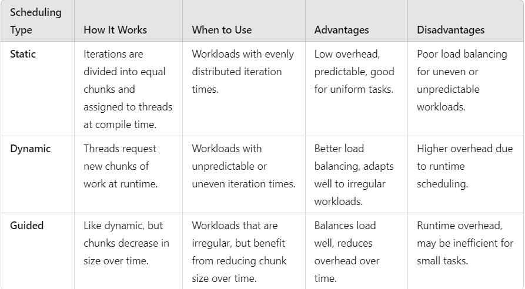
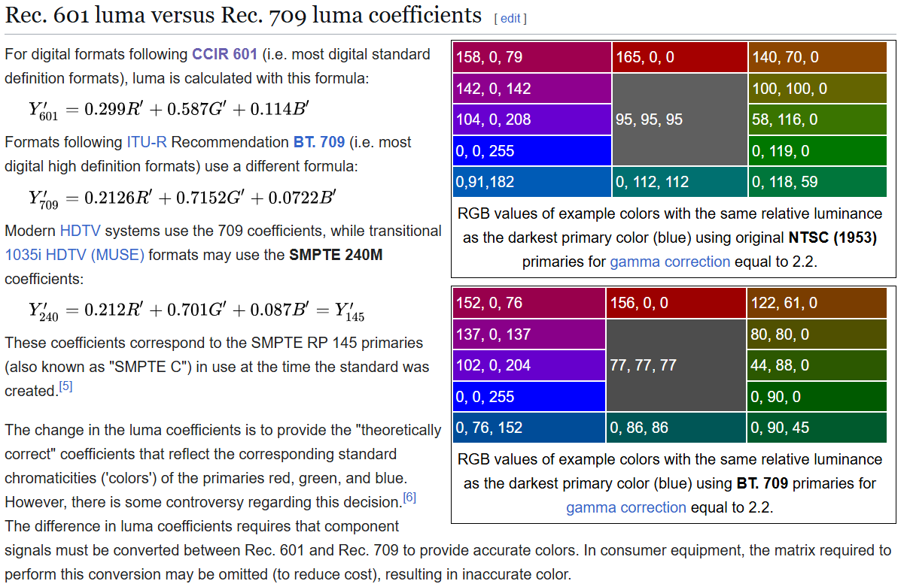
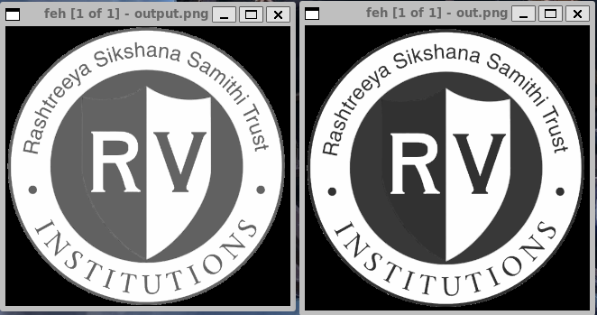

Write program to convert color image to black and white image.  
a) Demonstrate performance of different scheduling techniques for varying chunk sizes.  
b) Analyse scheduling patterns by assigning a single color value for an image for each thread.  

To run the output file:  
<pre> ./a.out input.png output.png </pre>

You will need gd library installed:  
<pre> sudo apt install libgd-dev </pre>
To compile the executable, add -lgd flag

To view png file from terminal, use following command:  
<pre>xdg-open [enter_path_to_png_file]</pre>  
WSL users can install feh:  
<pre> sudo apt install feh</pre>  
Usage:  
<pre>feh [enter_path_to_png_file]</pre>  

---

Differences between Static, Dynamic, Guided Scheduling:  
  

---

Information about Luma components:  
  

---

Comparision between normal greyscaling(left) vs Luma adjustment for BT.709 standards(right):  
  
